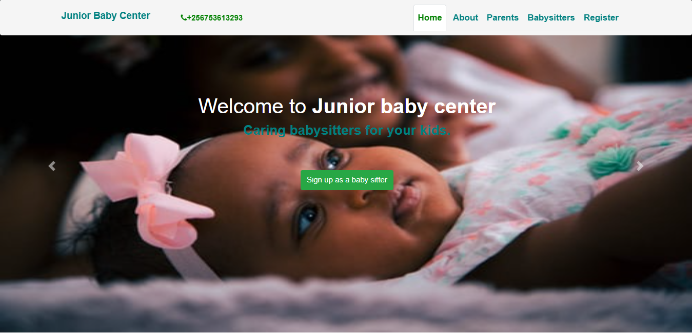

#                                                      Junior Baby Center (JBC)



## `What is Junior Baby Center?`
- Это проект, который намерен предоставить онлайн-платформу для покупки и продажи автомобилей!
#### ` - Сайт находится в стадии разработки и может не полностью реагировать на все устройства.`

## Какую проблему решает Helpavto?
- Легкость, с которой автомобили можно продавать и покупать в Интернете.

### `Инструменты:`
- Javascript | Next.js   | Reactjs
- Database    | Monogodb
- HTML | CSS

### `Настройка разработчика:`
- Разветвить этот репозиторий
```bash
git clone <repository>
cd папка репозитория/
```
- Установка и начало работы
    - Windows / Linux / Mac
    ```
    Запустите npm install, чтобы установить необходимый пакет.
    ```
    - Убедитесь, что у вас нет ошибок после запуска npm install.
    ```
    Обратите внимание на пакеты, которые вы устанавливаете (версии)
    ```
    ### `npm run dev`


- Если по какой-либо причине вы получите какие-либо ошибки после выполнения приведенной выше команды,
    - возможные решения
    - Удалите файл package-lock.json вместе с папками .next и node_modules.
- Снова запустите проект с помощью bash / cmd
    - Снова запустите проект с помощью bash / cmd
        ### `npm run dev`
